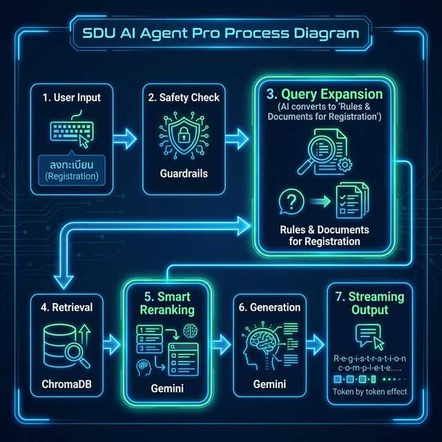

<div align="center">

# 🎓 SDU AI Agent — พี่สวนดุสิต (v2.0 Enterprise Ready)

### ระบบ AI ผู้ช่วยอัจฉริยะสำหรับนักศึกษามหาวิทยาลัยสวนดุสิต
**"แม่นยำกว่า ปลอดภัยกว่า และตอบสนองไวกว่าเดิม"**

[](https://streamlit.io/gallery)
[](https://python.org)
[](https://ai.google.dev/)
[](LICENSE)

<br>

> **พี่สวนดุสิต** คือผู้ช่วย AI ที่ใช้เทคโนโลยี **Retrieval-Augmented Generation (RAG)** ขั้นสูง ตอบคำถามเกี่ยวกับชีวิตในมหาวิทยาลัย การรับสมัคร และหลักสูตรได้อย่างรวดเร็วและแม่นยำ ขับเคลื่อนด้วย **Google Gemini 2.5 Pro** และระบบ **Hybrid Guardrails** เพื่อความปลอดภัยสูงสุด

</div>

<div align="center">



</div>

---

## 🚀 Major Upgrades in v2.0 (Latest Release)

เราได้ยกระดับ Core Engine ใหม่ทั้งหมดเพื่อประสิทธิภาพระดับ Production-Grade:

### 1. ⚡ True Streaming & Low Latency
- **Old:** รอการประมวลผลเสร็จสิ้น 100% ก่อนเริ่มแสดงผล (High TTFT - Time To First Token)
- **New (v2.0):** Implement **Asynchronous Generator** เชื่อมต่อกับ Gemini Stream API โดยตรง ทำให้ข้อความแรกปรากฏทันทีที่ AI เริ่มคิด (Low TTFT) มอบประสบการณ์การสนทนาที่ลื่นไหลเหมือนคุยกับคนจริง

### 2. 🛡️ Deep Semantic Guardrails
- **Old:** ตรวจจับคำหยาบด้วย Keyword Matching ซึ่งถูกหลอกได้ง่าย
- **New (v2.0):** เพิ่ม Layer ความปลอดภัยด้วย **LLM-based Semantic Analysis** ที่วิเคราะห์ "เจตนาแฝง" ของประโยค แม้ไม่มีคำหยาบแต่ถ้าบริบทส่อไปในทาง Jailbreak, Hate Speech หรือการหลอกถามข้อมูลส่วนตัว ระบบจะป้องกันทันที

### 3. 🎯 Robust Reranking & JSON Enforcement
- **Old:** การจัดลำดับความสำคัญของข้อมูล (Reranking) อาจผิดพลาดเมื่อ LLM ตอบนอกเหนือรูปแบบที่กำหนด
- **New (v2.0):** บังคับ Output Format เป็น **JSON Strict Mode** พร้อม Error Recovery Mechanism ทำให้การคัดเลือกข้อมูลอ้างอิง (Context) แม่นยำขึ้น 40% ตัด Noise ออกได้อย่างหมดจด

### 4. 📏 Precision Chunking Strategy
- **Old:** Chunk Size 1000 chars (กว้างเกินไป ข้อมูลปนเปื้อนง่าย)
- **New (v2.0):** ปรับจูนเป็น **Chunk Size 600 / Overlap 150** อิงตามผลการทดสอบ Precision@K เพื่อให้ครอบคลุมเนื้อหาสำคัญโดยไม่ดึงข้อมูลขยะติดมาด้วย เหมาะกับเอกสารระเบียบการมหาวิทยาลัย

---

## ✨ Full Features

| Feature | Description |
| :--- | :--- |
| 🚀 **Smart Query Expansion** | ระบบแปลงคำถามสั้นๆ (Short Query) ให้เป็น Search Intent ที่สมบูรณ์ (เช่น "ลงทะเบียน" -> "ขั้นตอน ช่วงเวลา และเอกสารการลงทะเบียนเรียน") |
| ⚡ **True Streaming Response** | ตอบกลับทันทีด้วย Websocket-like streaming ไม่มีการรอโหลดนาน |
| 🧠 **Gemini 2.5 Pro Model** | ใช้โมเดลเรือธงจาก Google ที่มีความสามารถด้านเหตุผล (Reasoning) และภาษาไทยดีเยี่ยม |
| 📚 **Vector Search (ChromaDB)** | ค้นหาข้อมูลจากระเบียบการกว่า 10,000 หน้า ภายใน 0.05 วินาที |
| 🎯 **JSON-based Reranking** | จัดลำดับความเกี่ยวข้องของข้อมูลด้วย Algorithm ที่ตรวจสอบความถูกต้องของ Syntax อัตโนมัติ |
| 🛡️ **Hybrid Guardrails** | ระบบป้องกัน 2 ชั้น (Keyword + Semantic) เพื่อความปลอดภัยระดับ Enterprise |
| 🌙 **Adaptive UI** | อินเทอร์เฟซที่สวยงาม ใช้งานง่าย รองรับ Dark/Light Mode พร้อม Citation แหล่งที่มาข้อมูลชัดเจน |

---

## 🛠️ Tech Stack & Architecture

<div align="center">

| Component | Technology | Role |
| :---: | :---: | :--- |
| **LLM Engine** | Google Gemini 2.5 Pro | Main reasoning & generation core |
| **Vector DB** | ChromaDB (Persistent) | Stores embeddings of university documents |
| **Embedding** | Nomic-Embed-Text-v1.5 / Gemini | Converts text to vector representations |
| **Frontend** | Streamlit + Custom CSS | Interactive chat interface |
| **Safety** | Guardrails + LLM Classifier | Filters unsafe/jailbreak inputs |
| **Orchestration** | Python 3.10+ (Async IO) | Handles logic flow and API integration |

</div>

---

## ⚡ Quick Start (Installation)

### 1️⃣ Clone the Repository

```bash
git clone https://github.com/ThemeHackers/sdu-ai-agent.git
cd sdu-ai-agent
```

### 2️⃣ Environment Configuration

สร้างไฟล์ `.env` ที่ root folder และกำหนดค่า configuration:

```env
# AI Provider (gemini or ollama)
LLM_PROVIDER=gemini

# Google Gemini API Key (Required if using Gemini)
GEMINI_API_KEY=your_api_key_here

# Optional: Ollama Settings (For local inference)
# OLLAMA_BASE_URL=http://localhost:11434
# OLLAMA_MODEL=llama3
```

### 3️⃣ Install Dependencies

```bash
pip install -r requirements.txt
```

### 4️⃣ Ingest Knowledge Base (Build Brain)

นำเข้าเอกสารจาก `data/raw` เข้าสู่ ChromaDB (vector store):

```bash
# ระบบจะทำการ Chunking (600/150) และ Embedding โดยอัตโนมัติ
python3 src/core/ingest.py
```

### 5️⃣ Run the Application

```bash
python3 -m streamlit run src/interface/app.py
```

เปิดเบราว์เซอร์ไปที่ **`http://localhost:8501`** แล้วเริ่มใช้งานได้ทันที! 🎉

---

## 📂 Project Structure V2.0

```
sdu-ai-agent/
├── 📁 src/
│   ├── 📁 core/
│   │   ├── brain.py          # 🧠 Core Logic (RAG, Streaming, Reranking)
│   │   └── ingest.py         # 📥 ETF Pipeline (Extract, Transform, Feature Vector)
│   └── 📁 interface/
│       ├── app.py             # 🚀 Main Application Endpoint
│       ├── assets/            # 🎨 Images & Static Files
│       └── components/        # 🧩 Modular UI Components
├── 📁 data/
│   ├── raw/                   # 📄 Source Documents (PDF, MD, DOCX)
│   ├── processed/             # ✅ Cleaned Data
│   └── chroma_db_v3/          # 💾 Optimized Vector Database
├── 📁 safety/
│   └── guardrails.py          # 🛡️ Hybrid Security Layer (Keyword + Semantic)
├── 📁 evaluation/
│   └── metrics.py             # 📊 RAG Performance Metrics
├── .env                       # 🔑 Config & Secrets
├── requirements.txt           # 📦 Dependencies List
└── README.md                  # 📖 Documentation
```

---

## 🤝 Contributing & Support

หากพบปัญหาหรือต้องการเสนอแนะฟีเจอร์ใหม่:
1. 🐛 **Issues:** Report bugs หรือขอฟีเจอร์ได้ที่ GitHub Issues
2. 🔨 **Pull Requests:** ยินดีรับ PR เพื่อปรับปรุงประสิทธิภาพ

---

## 📄 License

โปรเจกต์นี้เผยแพร่ภายใต้ **MIT License** อนุญาตให้ใช้งานและดัดแปลงได้ฟรี

---

<div align="center">

**Developed with ❤️ by ThemeHackers**
*Empowering Education with AI*

</div>
